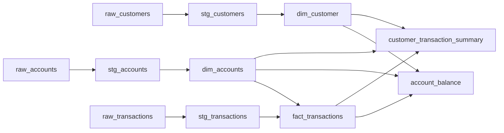

# Snowflake + dbt Banking Analytics Project — End-to-End Documentation

## 1. Project Overview

This project implements an **ELT pipeline** on **Snowflake**, transformed with **dbt**, that turns raw banking data (customers, accounts, transactions) into analytics-ready fact and mart tables for reporting.

```
Raw Data (S3) → Snowflake Raw Tables → dbt Staging → dbt Dimensions/Facts → dbt Marts → BI Tools
```

**Project name:** `snowflake_project1`
**Warehouse:** Snowflake
**Transformation tool:** dbt (dbt-snowflake adapter)

---

## 2. High-Level Architecture

```
        ┌────────────────────┐
        │   Source Systems    │
        │ (Banking App / CRM) │
        └─────────┬───────────┘
                  │  Extract & Load
                  ▼
        ┌────────────────────┐
        │   Amazon S3 (Files) │
        └─────────┬───────────┘
                  │  COPY INTO / Snowpipe
                  ▼
        ┌────────────────────────────┐
        │  Snowflake RAW Layer        │
        │  mydb.myschema.raw_customers│
        │  mydb.myschema.raw_accounts │
        │  mydb.myschema.raw_transactions│
        └─────────┬────────────────────┘
                  │  dbt run (staging)
                  ▼
        ┌────────────────────┐
        │  Staging Layer       │
        │  stg_customers        │
        │  stg_accounts          │
        │  stg_transactions       │
        └─────────┬───────────┘
                  │  dbt run (dims/facts)
                  ▼
        ┌────────────────────────────┐
        │  Dimension + Fact Layer      │
        │  dim_customer                │
        │  dim_accounts                │
        │  fact_transactions            │
        └─────────┬───────────────────┘
                  │  dbt run (marts)
                  ▼
        ┌────────────────────────────┐
        │  Mart Layer (business-ready) │
        │  account_balance               │
        │  customer_transaction_summary   │
        └─────────┬───────────────────┘
                  │
                  ▼
        ┌────────────────────┐
        │   BI Tools           │
        │ Tableau / Power BI    │
        └────────────────────┘
```

---

## 3. Source (Raw) Tables in Snowflake

Defined in `schema.yml` under `sources`:

| Source Table | Schema | Description |
|---|---|---|
| `raw_customers` | `mydb.myschema` | Raw customer data loaded from S3 |
| `raw_accounts` | `mydb.myschema` | Raw account data loaded from S3 |
| `raw_transactions` | `mydb.myschema` | Raw transaction data loaded from S3 |

These are the tables your staging models read from directly (via hardcoded schema references — see note in Section 7).

---

## 4. dbt Project Structure

Based on your `dbt_project.yml`, models are configured per folder:

```
snowflake_project1/
│
├── models/
│   ├── staging/
│   │   ├── stg_customers.sql
│   │   ├── stg_accounts.sql
│   │   └── stg_transactions.sql
│   │
│   ├── dimensions/
│   │   ├── dim_customer.sql
│   │   └── dim_accounts.sql
│   │
│   ├── facts/
│   │   └── fact_transactions.sql
│   │
│   ├── marts/
│   │   ├── account_balance.sql
│   │   └── customer_transaction_summary.sql
│   │
│   └── schema.yml
│
├── seeds/
├── snapshots/
├── macros/
├── tests/
├── dbt_project.yml
└── README.md
```

> ⚠️ **Action needed:** Your uploaded `.sql` files are currently flat (not yet placed in `staging/`, `dimensions/`, `facts/`, `marts/` subfolders). Since `dbt_project.yml` sets `+materialized: table` per folder, you need to physically move each file into its matching folder for those configs to apply. Otherwise dbt will use the default materialization (`view`) for any model outside a configured folder.

---

## 5. Layer-by-Layer Model Details

### Staging Layer (1:1 cleanup of raw tables)

| Model | Source | Key Logic |
|---|---|---|
| `stg_customers` | `raw_customers` | Dedupe via `ROW_NUMBER()` partitioned by `customer_id`, ordered by `customer_since DESC`; keeps latest record (`rn = 1`) |
| `stg_accounts` | `raw_accounts` | Dedupe via `ROW_NUMBER()` partitioned by `account_id`, ordered by `open_date DESC`; filters out null `account_id`/`customer_id` |
| `stg_transactions` | `raw_transactions` | Dedupe via `ROW_NUMBER()` partitioned by `transaction_id`; filters to `transaction_type IN ('credit','debit')` |

All staging models are `materialized='table'` and tagged `staging`.

### Dimension Layer

| Model | Built From | Logic |
|---|---|---|
| `dim_customer` | `ref('stg_customers')` | Straight pass-through (`SELECT *`) |
| `dim_accounts` | `ref('stg_accounts')` | Straight pass-through (`SELECT *`) |

### Fact Layer

| Model | Built From | Logic |
|---|---|---|
| `fact_transactions` | `ref('stg_transactions')` joined to `ref('dim_accounts')` | Inner join on `account_id`; grain = one row per transaction |

### Mart Layer (business-ready, consumed by BI)

| Model | Built From | Logic |
|---|---|---|
| `account_balance` | `fact_transactions` + `dim_accounts` + `dim_customer` | Nets credits minus debits per account → `current_balance`; also returns `last_transaction_date` |
| `customer_transaction_summary` | `fact_transactions` + `dim_accounts` + `dim_customer` | Aggregates transaction count, total amount, first/last transaction date per customer |

---

## 6. Data Lineage (DAG)



Run `dbt docs generate && dbt docs serve` to get this same lineage as an interactive graph once the project runs successfully.

---

## 7. Testing Strategy (current + recommended fix)

Your `schema.yml` currently uses the **legacy dbt test syntax**:

```yaml
- name: stg_accounts
  tests:
    - not_null:
        column_name: account_id
```

This shorthand form is deprecated in modern dbt (v1.x). It should be rewritten under `columns:` like this:

```yaml
- name: stg_accounts
  description: "Cleaned staging accounts"
  columns:
    - name: account_id
      tests:
        - not_null
        - unique
    - name: customer_id
      tests:
        - not_null
```

Apply the same fix to `stg_customers`, `stg_transactions`, `customer_transaction_summary`, and `account_balance`. Otherwise `dbt run`/`dbt test` may throw a parsing error or silently skip tests depending on your dbt version.

**Recommended additional tests:**
- `relationships` test: `fact_transactions.account_id` → `dim_accounts.account_id`
- `relationships` test: `dim_accounts.customer_id` → `dim_customer.customer_id`
- `accepted_values` test on `stg_transactions.transaction_type` (`['credit','debit']`)

---

## 8. Step-by-Step Implementation Guide (Snowflake → dbt)

### Step 1 — Set up Snowflake objects
```sql
CREATE WAREHOUSE IF NOT EXISTS dbt_wh WAREHOUSE_SIZE='XSMALL' AUTO_SUSPEND=60 AUTO_RESUME=TRUE;
CREATE DATABASE IF NOT EXISTS mydb;
CREATE SCHEMA IF NOT EXISTS mydb.myschema;
CREATE ROLE IF NOT EXISTS dbt_role;
GRANT USAGE ON WAREHOUSE dbt_wh TO ROLE dbt_role;
GRANT ALL ON DATABASE mydb TO ROLE dbt_role;
GRANT ALL ON SCHEMA mydb.myschema TO ROLE dbt_role;
GRANT ROLE dbt_role TO USER <your_user>;
```

### Step 2 — Create raw tables and load data
Create `raw_customers`, `raw_accounts`, `raw_transactions` matching your source data, then load via stage + `COPY INTO`:
```sql
CREATE OR REPLACE STAGE mydb.myschema.banking_stage
  URL='s3://<your-bucket>/banking/'
  CREDENTIALS=(AWS_KEY_ID='...' AWS_SECRET_KEY='...');

COPY INTO mydb.myschema.raw_customers
FROM @mydb.myschema.banking_stage/customers/
FILE_FORMAT=(TYPE=CSV SKIP_HEADER=1);
```
(Repeat for `raw_accounts`, `raw_transactions`.) For production, prefer a **Storage Integration** over hardcoded keys, and consider **Snowpipe** for continuous loads.

### Step 3 — Install dbt and the Snowflake adapter
```bash
pip install dbt-snowflake
dbt --version
```

### Step 4 — Configure `profiles.yml` (usually in `~/.dbt/profiles.yml`)
```yaml
snowflake_project1:
  target: dev
  outputs:
    dev:
      type: snowflake
      account: <your_account_locator>
      user: <your_user>
      password: <your_password>
      role: dbt_role
      database: mydb
      warehouse: dbt_wh
      schema: myschema
      threads: 4
```
Test the connection:
```bash
dbt debug
```

### Step 5 — Organize your project
- Place the uploaded `.sql` files into `models/staging/`, `models/dimensions/`, `models/facts/`, `models/marts/` per Section 4.
- Fix `schema.yml` test syntax per Section 7.
- Keep `dbt_project.yml` as-is (it already maps folder → materialization correctly).

### Step 6 — Run the pipeline
```bash
dbt run           # builds all models in dependency order (staging → dims/facts → marts)
dbt test          # runs the data quality tests
dbt docs generate # generates documentation + lineage graph
dbt docs serve    # opens interactive docs in browser
```

To run a single layer during development:
```bash
dbt run --select staging.*
dbt run --select tag:staging
dbt run --select +fact_transactions   # model + everything upstream
```

### Step 7 — Schedule / orchestrate (production)
Options:
- **dbt Cloud** scheduler (simplest)
- **Apache Airflow** with a `BashOperator`/`dbt Cloud provider` triggering `dbt run` and `dbt test`
- **Snowflake Tasks** calling an external orchestrator webhook

### Step 8 — Connect BI tool
Point Tableau / Power BI at the `mart` schema (`account_balance`, `customer_transaction_summary`) — these are your business-ready, query-optimized tables.

---

## 9. Suggested Next Steps / Improvements

- Convert `stg_*` sources from hardcoded `mydb.myschema.raw_*` to `{{ source('mydb','raw_customers') }}` style refs (you already define sources in `schema.yml` — the staging models should use them for lineage tracking and freshness checks).
- Move `account_id`/`customer_id` duplication checks (`unique`, `not_null`) onto fact/dim grain columns too.
- Consider `incremental` materialization for `fact_transactions` once transaction volume grows (see incremental pattern in your dbt prep notes).
- Add `dbt_utils` package for surrogate key generation and generic tests.
